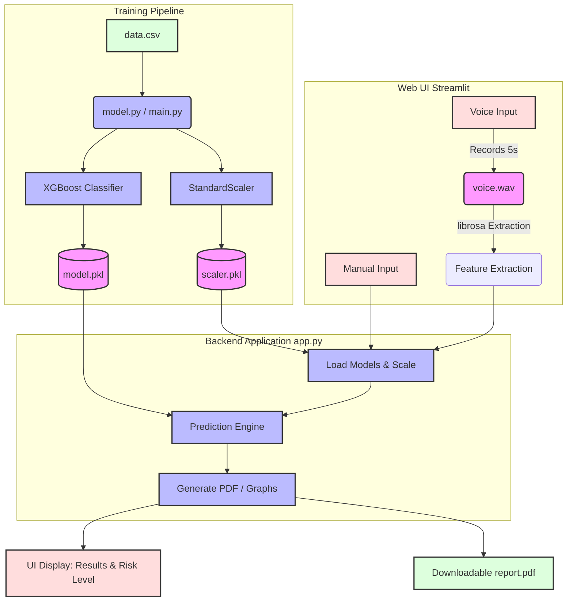

# Project Architecture Analysis

Based on the source code in your directory, here is an analysis of the Neural-Degradation-Project.

## Overview
The project is a **Parkinson's Disease Detection System** built with Python. It uses an **XGBoost** machine learning model to classify whether a patient has Parkinson's based on vocal features (Jitter, Shimmer, and PPE). It provides a user-friendly frontend using **Streamlit** where users can either manually input these features or record their voice directly to get a real-time prediction and generate a medical report.

## Components Breakdown

1. **Data & Training Pipeline ([model.py](file:///c:/Users/HP/Desktop/Neural-Degradation-Project/model.py), [main.py](file:///c:/Users/HP/Desktop/Neural-Degradation-Project/main.py))**
   - **Data Input:** Loads patient voice metrics from [data.csv](file:///c:/Users/HP/Desktop/Neural-Degradation-Project/data.csv).
   - **Preprocessing:** Extracts three core features: `MDVP:Jitter(%)`, `MDVP:Shimmer`, and `PPE`. It uses `StandardScaler` to normalize the data.
   - **Model:** Trains an `XGBClassifier` (XGBoost) model.
   - **Artifacts:** Exports the trained model to [model.pkl](file:///c:/Users/HP/Desktop/Neural-Degradation-Project/model.pkl) and the fitted scaler to [scaler.pkl](file:///c:/Users/HP/Desktop/Neural-Degradation-Project/scaler.pkl) to be consumed by the web app.

2. **Web Application ([app.py](file:///c:/Users/HP/Desktop/Neural-Degradation-Project/app.py))**
   - **Framework:** Built with Streamlit for a responsive, interactive UI.
   - **Input Modalities:**
     - **Manual:** Clinicians can manually enter Jitter, Shimmer, and PPE metrics.
     - **Voice (Audio):** Uses `sounddevice` to record a 5-second audio clip ([voice.wav](file:///c:/Users/HP/Desktop/Neural-Degradation-Project/voice.wav)), then uses the `librosa` library to dynamically extract the three acoustic features from the audio.
   - **Prediction & Feedback:** Loads the [.pkl](file:///c:/Users/HP/Desktop/Neural-Degradation-Project/model.pkl) files, scales inputs, and predicts the likelihood of Parkinson's (`No Parkinson` / `Parkinson`), showing real-time probability and Risk Level (Low/Medium/High).
   - **Reporting:** Uses `matplotlib` to plot data distribution or audio waveforms, and `reportlab` to generate a downloadable PDF Medical Report.

## Architecture Diagram

